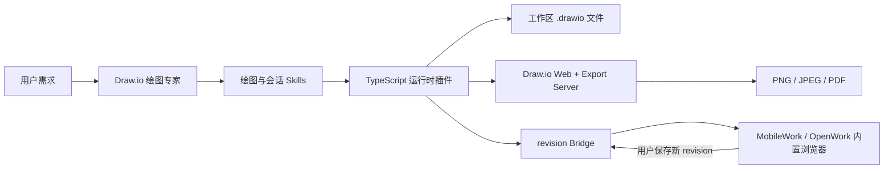

# Draw.io 绘图专家

<div align="center">

面向 MobileWork / OpenWork 的 Draw.io 单专家包：创建和修改可编辑图表，通过自托管 Draw.io 服务导出图片，并在内置浏览器中完成人机协同编辑。


</div>

## 功能

- 根据自然语言创建架构图、流程图、ER 图、UML、BPMN、SysML、网络拓扑和基础设施图。
- 读取、检查、比较和增量修改压缩或非压缩的 `.drawio` 文件。
- 使用稳定 ID 修改节点和连线，避免无关内容被整图重建。
- 通过自托管的 `jgraph/drawio` + `jgraph/export-server` 导出 PNG、JPEG、PDF 和可编辑 PNG；通过内置浏览器编辑器导出 SVG、可编辑 SVG 和 HTML。
- 创建或修改结束后自动导出同名 PNG，并在 MobileWork / OpenWork 内置浏览器中打开。
- 用户在浏览器保存后，将最新 XML 和 revision 作为 Agent 下一次修改的基线。
- 用户可对选区提交按图表文件持久化的注释，并选择“只修改选区”“允许调整关联连线”“允许调整周边布局”或“允许修改整个图表”；全图范围会额外确认，Agent正式写入前仍必须通过OpenCode审批弹窗取得当前session的一次性授权。
- 通过 revision 冲突检查避免旧快照覆盖最新内容；人工编辑本身仍可按当前任务要求继续调整。
- 检查节点重叠、边穿节点、边交叉、嵌套容器坐标、边标签碰撞、空标签和缺少跳线等质量问题。

## 工作方式



核心运行时是构建后随专家包分发的单文件 `drawio-runtime.js`。最终用户不需要安装 Python、uv、npm、额外 Node 依赖或 Draw.io Desktop。

## 快速开始

### 1. 启动自包含 Draw.io Docker 服务

使用 jGraph 官方 [self-contained/docker-compose.yml](https://github.com/jgraph/docker-drawio/blob/dev/self-contained/docker-compose.yml)，将两个服务的端口改为：

```yaml
services:
  image-export:
    ports:
      - "18765:8000"

  drawio:
    ports:
      - "8443:8443"
      - "18080:8080"
```

在 `docker-compose.yml` 同目录创建 `.env`：

```dotenv
DRAWIO_SERVER_URL=http://127.0.0.1:18080/
DRAWIO_BASE_URL=http://127.0.0.1:18080
```

```powershell
docker compose pull
docker compose up -d
docker compose ps
```

### 2. 配置工作区环境变量

将 [.env.example](.env.example) 复制为工作区根目录下的 `.env`：

```dotenv
DRAWIO_WEB_URL=http://127.0.0.1:18080
DRAWIO_BRIDGE_HOST=127.0.0.1
DRAWIO_BRIDGE_PORT=0
DRAWIO_EXPORT_URL=http://127.0.0.1:18765/ImageExport4/export
DRAWIO_REQUEST_TIMEOUT=60
DRAWIO_MAX_INPUT_SIZE_MB=20
DRAWIO_MAX_OUTPUT_SIZE_MB=100
```

端口对应关系：

| 工作区变量 | Compose 服务 | 端口映射 |
|---|---|---|
| `DRAWIO_WEB_URL` | `drawio` | `18080:8080` |
| `DRAWIO_EXPORT_URL` | `image-export` | `18765:8000` |

其余变量用于 Bridge 监听、请求超时和文件大小限制。修改 `.env` 后重启 MobileWork / OpenWork。

### 3. 构建专家包

构建工程需要：

- Node.js，用于运行构建脚本；
- Bun，用于安装构建依赖并打包 TypeScript 插件；
- Python，以及已安装的 `mobilework-expert-manager`，用于生成和校验 MobileWork 专家包。

在本目录执行：

```powershell
node scripts/build-expert.mjs
```

构建脚本会：

1. 按 `bun.lock` 安装构建依赖；
2. 将 `runtime/drawio-runtime.ts` 及依赖打包为单文件插件；
3. 同步 `expert.json`；
4. 生成 MobileWork 专家包；
5. 复制完整 Skills 并检查中文 frontmatter、Markdown 链接和缓存文件；
6. 运行专家包结构校验。

生成结果位于：

```text
generated/drawio-expert/
```

> 构建依赖只用于开发阶段。`generated/drawio-expert/` 不包含 `node_modules`、Python MCP 或运行时依赖清单。

### 4. 安装到工作区

#### MobileWork

MobileWork 工作区不要直接覆盖现有 `.opencode`。使用 `mobilework-expert-manager` 的安装脚本复制 Agent、Skills、命令和插件，并把本包的运行时配置合并到 `<workspace>/.opencode/opencode.jsonc`。

以下示例安装到 `D:\workspace\opencode`：

```powershell
python "$env:USERPROFILE\.agents\skills\mobilework-expert-manager\scripts\install_expert.py" `
  --package-dir ".\generated\drawio-expert" `
  --workspace-dir "D:\workspace\opencode"
```

首次安装不要加 `--force`。如果脚本报告同名 Agent、Skill、插件或配置项已经存在，先检查冲突内容；确认要用本包版本覆盖时，再在命令末尾加 `--force`。

安装后主要文件包括：

```text
<workspace>/.opencode/
├── agents/drawio-expert.md
├── plugins/drawio-runtime.js
├── skills/drawio-skill/
├── skills/drawio-session-editing/
└── opencode.jsonc
```

安装脚本不会把包根目录的 `.env.example` 安装成真实配置，还需要执行：

```powershell
Copy-Item ".\generated\drawio-expert\.env.example" "D:\workspace\opencode\.env"
```

检查其中的本地 Draw.io 地址后，完全重启 MobileWork，并在 MobileWork 中选择同一个 `D:\workspace\opencode` 工作区。

#### OpenWork

OpenWork 不使用上面的 MobileWork 安装脚本。把生成专家包的**全部内容**直接复制到 OpenWork 工作区根目录即可；目标目录应是用于该专家的空工作区：

```powershell
$package = Resolve-Path ".\generated\drawio-expert"
$workspace = "D:\workspace\drawio-expert"

New-Item -ItemType Directory -Force $workspace | Out-Null
Get-ChildItem -LiteralPath $package -Force |
  Copy-Item -Destination $workspace -Recurse

Copy-Item `
  -LiteralPath "$workspace\.env.example" `
  -Destination "$workspace\.env"
```

复制完成后，`opencode.json`、`AGENTS.md`、`.opencode/` 和 `.env` 都应直接位于 `D:\workspace\drawio-expert` 根目录。然后在 OpenWork 中选择该目录并完全重启对应的 OpenCode 进程；无需再拆分目录、合并配置或运行安装脚本。加载成功后应能看到 `drawio-expert` Agent、四个 Draw.io Skills、六个 `/drawio-*` 命令，以及 `drawio_*` 工具。

## 使用示例

选择“Draw.io 绘图专家”后，直接描述任务：

```text
根据当前项目生成一张系统架构图。
```

```text
修改 architecture.drawio，增加 Redis 缓存层并保留现有布局。
```

```text
在内置浏览器打开这张图，我手动调整后你再继续完善。
```

```text
检查连线、标签和节点是否重叠，修复后导出 PNG。
```

每次创建或修改成功后，专家应调用 `drawio_finalize`，完成校验、质量评分、同名 PNG 导出和会话绑定。仅当返回 `shouldOpenBrowser=true` 时打开内置浏览器；已有编辑器连接时禁止重复打开或刷新，避免覆盖用户尚未保存的编辑。PNG 默认使用白色背景，避免透明区域在深色预览器中显示为黑色；仍可通过 `background` 参数指定其他颜色。

## 内置命令

| 命令 | 用途 |
|---|---|
| `/drawio-create` | 创建、校验并预览 Draw.io 文件 |
| `/drawio-inspect` | 读取并解释现有图表 |
| `/drawio-patch` | 通过稳定 ID 增量修改图表 |
| `/drawio-polish` | 自动布局、路由调整和质量门禁 |
| `/drawio-export` | 导出 PNG、JPEG、PDF、可编辑PNG（Docker）；SVG、可编辑SVG、HTML（内置浏览器编辑器） |
| `/drawio-open` | 在 MobileWork / OpenWork 内置浏览器中打开并协同编辑 |

## 会话与并发安全

已经通过 `drawio_open` 绑定的文件遵循以下流程：

1. Agent 写入前调用 `drawio_get_state`；
2. 使用返回的最新 XML 作为修改基线；
3. 提交时携带该次读取对应的 `base_revision`；
4. 如果出现 `revision_conflict`，重新读取最新状态并在新版本上执行修改；
5. 禁止用普通 `write`、`edit` 或脚本直接覆盖活动会话文件。

revision 协议防止的是旧版本误覆盖，不会把用户手动编辑的图元变成只读内容。
Agent 或外部写入产生新 revision 时，浏览器会提示但不会强制刷新当前画布，避免覆盖尚未触发 autosave 的人工编辑；已有编辑器连接时，Agent 也不得通过重复打开 URL 刷新页面。浏览器随后保存旧 revision 时会按页面、稳定图元 ID 和图元字段做三方合并：不同图元或同一图元的不同字段自动合并；同一字段修改冲突时，弹窗逐字段对比“我的未保存版本”和“AI 已保存版本”。无论选择哪一方，双方所有非冲突修改都会保留。保存请求期间若用户继续输入，合并响应不会强制刷新这部分新编辑。Agent 工具写入仍保持显式的 `revision_conflict` 读取、合并、重试流程。

## 质量检查

默认质量阈值为 90，主要指标包括：

| 指标 | 说明 |
|---|---|
| `overlaps` | 同一坐标空间中的节点重叠 |
| `edgeNodeIntersections` | 连线穿过非端点节点 |
| `edgeCrossings` | 无共享端点的连线交叉 |
| `labelOverlaps` | 边标签与节点、容器标题或其他边标签重叠 |
| `emptyLabels` | 非结构容器节点缺少标签 |
| `missingLineJumps` | 连线未启用 arc 跳线 |

评分器会递归解析嵌套容器坐标，并读取边的 waypoint、入口/出口锚点及标签 offset。它是静态几何检查器，不是完整 Draw.io 渲染器；缺少显式路由信息时会采用确定性的正交路径估算。

## 测试

运行核心集成测试：

```powershell
node tests/integrated.integration.mjs
```

该测试覆盖非 Git 工作区、revision 冲突、并发写入、嵌套容器、真实边穿节点、边标签碰撞、自动 PNG 和浏览器打开地址。

运行真实 Docker 导出测试：

```powershell
node tests/docker.integration.mjs
```

该测试要求上面的两个 Compose 服务均已启动，并会通过 `http://127.0.0.1:18765/ImageExport4/export` 实际导出 PNG。

## 项目结构

```text
mobilework-drawio/
├── expert.json                         # MobileWork 专家 manifest
├── runtime/
│   └── drawio-runtime.ts               # TypeScript 工具、评分器、Bridge 和导出客户端
├── skill-sources/
│   ├── drawio-skill/                   # 绘图工作流、参考资料、样式和可选脚本
│   └── drawio-session-editing/         # revision 会话协议
├── scripts/
│   ├── sync-expert-source.mjs          # 打包插件并同步 manifest
│   └── build-expert.mjs                # 生成和校验专家包
├── tests/
│   ├── integrated.integration.mjs      # 核心集成测试
│   └── docker.integration.mjs          # 真实 Docker 导出测试
├── generated/drawio-expert/            # 构建产物
├── .env.example
├── package.json
└── bun.lock
```

`runtime/drawio-export-mcp/` 是未进入当前生成包的旧实现目录；当前默认运行链路只使用打包后的 TypeScript 插件。

## 能力边界

- 导出格式：PNG、JPEG、PDF、可编辑PNG（`xmlpng`，Docker Export Server 通道）；SVG、可编辑SVG（`xmlsvg`）、HTML（`html2`，内置浏览器编辑器页面渲染，页面未打开时工具返回 `editor_required` 与 `openUrl`，经 `browser.open_url` 打开后重试即可）。
- 不调用 Draw.io Desktop，也不依赖 `rlespinasse/drawio-export`；推荐运行时依赖官方 Compose 中的 `jgraph/drawio` 与 `jgraph/export-server`。
- Skills 中的数据提取、Graphviz 自动布局等高级脚本是可选能力；只有使用这些脚本时才需要 Python 或相应第三方工具。
- Bridge 仅监听本机回环地址，文件工具只允许访问当前工作区内的相对路径。
- 专家运行时不会管理 Docker、MobileWork 或 OpenWork 的安装、启动与升级。

## 开发约定

- `expert.json`、`runtime/` 和 `skill-sources/` 是源文件；不要直接维护 `generated/` 中的派生文件。
- 修改运行时或 Skills 后重新运行 `node scripts/build-expert.mjs`。
- 提交前至少运行核心集成测试、真实 Docker 测试和专家包校验。
- 提交信息建议遵循 Conventional Commits，例如：

```text
feat(drawio): add label collision quality checks
fix(session): preserve latest browser revision before agent writes
docs(readme): document build and installation workflow
```
