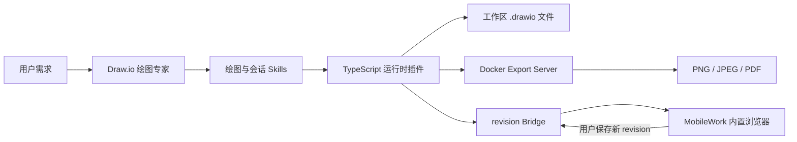

# Draw.io 绘图专家

<div align="center">

面向 MobileWork / OpenCode 的 Draw.io 单专家包：创建和修改可编辑图表，通过 Docker 导出图片，并在内置浏览器中完成人机协同编辑。


</div>

## 功能

- 根据自然语言创建架构图、流程图、ER 图、UML、BPMN、SysML、网络拓扑和基础设施图。
- 读取、检查、比较和增量修改压缩或非压缩的 `.drawio` 文件。
- 使用稳定 ID 修改节点和连线，避免无关内容被整图重建。
- 通过 Docker HTTP Export Server 导出 PNG、JPEG 和 PDF。
- 创建或修改结束后自动导出同名 PNG，并在 MobileWork 内置浏览器中打开。
- 用户在浏览器保存后，将最新 XML 和 revision 作为 Agent 下一次修改的基线。
- 通过 revision 冲突检查避免旧快照覆盖最新内容；人工编辑本身仍可按当前任务要求继续调整。
- 检查节点重叠、边穿节点、边交叉、嵌套容器坐标、边标签碰撞、空标签和缺少跳线等质量问题。

## 工作方式



核心运行时是构建后随专家包分发的单文件 `drawio-runtime.js`。最终用户不需要安装 Python、uv、npm、额外 Node 依赖或 Draw.io Desktop。

## 快速开始

### 1. 准备导出服务

启动一个兼容 `ImageExport4/export` 的 Docker HTTP Export Server。默认地址为：

```text
http://127.0.0.1:18765/ImageExport4/export
```

本工程只连接该服务，不在专家运行时启动或管理 Docker 容器。

### 2. 配置环境变量

将 [.env.example](.env.example) 复制为当前 OpenCode 工作区根目录下的 `.env`。插件初始化时会显式读取该文件；宿主进程已经设置的同名环境变量优先，修改 `.env` 后需要重启 OpenCode 插件进程：

```dotenv
DRAWIO_WEB_URL=https://embed.diagrams.net
DRAWIO_BRIDGE_HOST=127.0.0.1
DRAWIO_BRIDGE_PORT=0
DRAWIO_EXPORT_URL=http://127.0.0.1:18765/ImageExport4/export
DRAWIO_REQUEST_TIMEOUT=60
DRAWIO_MAX_INPUT_SIZE_MB=20
DRAWIO_MAX_OUTPUT_SIZE_MB=100
```

主要配置：

| 变量 | 默认值 | 用途 |
|---|---|---|
| `DRAWIO_WEB_URL` | `https://embed.diagrams.net` | 内置浏览器加载的 Draw.io Web 编辑器 |
| `DRAWIO_BRIDGE_HOST` | `127.0.0.1` | 会话 Bridge 监听地址，仅允许本机回环地址 |
| `DRAWIO_BRIDGE_PORT` | `0` | Bridge 端口；`0` 表示自动选择空闲端口 |
| `DRAWIO_EXPORT_URL` | `http://127.0.0.1:18765/ImageExport4/export` | Docker 导出接口 |
| `DRAWIO_REQUEST_TIMEOUT` | `60` | 导出请求超时，单位为秒 |
| `DRAWIO_MAX_INPUT_SIZE_MB` | `20` | 最大 Draw.io 输入大小 |
| `DRAWIO_MAX_OUTPUT_SIZE_MB` | `100` | 最大导出文件大小 |

### 3. 构建专家包

构建工程需要：

- Node.js，用于运行构建脚本；
- Bun，用于安装构建依赖并打包 TypeScript 插件；
- Python，以及已安装的 `mobilework-expert-manager`，用于生成和校验 MobileWork 专家包。

在本目录执行：

```powershell
node scripts/build-expert.mjs
```

构建脚本会：

1. 按 `bun.lock` 安装构建依赖；
2. 将 `runtime/drawio-runtime.ts` 及依赖打包为单文件插件；
3. 同步 `expert.json`；
4. 生成 MobileWork 专家包；
5. 复制完整 Skills 并检查中文 frontmatter、Markdown 链接和缓存文件；
6. 运行专家包结构校验。

生成结果位于：

```text
generated/drawio-expert/
```

> 构建依赖只用于开发阶段。`generated/drawio-expert/` 不包含 `node_modules`、Python MCP 或运行时依赖清单。

### 4. 安装到 MobileWork 工作区

以下示例安装到 `D:\workspace\opencode`：

```powershell
python "$env:USERPROFILE\.agents\skills\mobilework-expert-manager\scripts\install_expert.py" `
  --package-dir ".\generated\drawio-expert" `
  --workspace-dir "D:\workspace\opencode" `
  --force
```

安装后主要文件包括：

```text
<workspace>/.opencode/
├── agents/drawio-expert.md
├── plugins/drawio-runtime.js
├── skills/drawio-skill/
├── skills/drawio-session-editing/
└── opencode.jsonc
```

安装或更新后应完全重启 MobileWork / OpenCode，使 Agent、Skills 和插件重新加载。

## 使用示例

选择“Draw.io 绘图专家”后，直接描述任务：

```text
根据当前项目生成一张系统架构图。
```

```text
修改 architecture.drawio，增加 Redis 缓存层并保留现有布局。
```

```text
在内置浏览器打开这张图，我手动调整后你再继续完善。
```

```text
检查连线、标签和节点是否重叠，修复后导出 PNG。
```

每次创建或修改成功后，专家应调用 `drawio_finalize`，完成校验、质量评分、同名 PNG 导出、会话绑定和内置浏览器打开。PNG 默认使用白色背景，避免透明区域在深色预览器中显示为黑色；仍可通过 `background` 参数指定其他颜色。

## 内置命令

| 命令 | 用途 |
|---|---|
| `/drawio-create` | 创建、校验并预览 Draw.io 文件 |
| `/drawio-inspect` | 读取并解释现有图表 |
| `/drawio-patch` | 通过稳定 ID 增量修改图表 |
| `/drawio-polish` | 自动布局、路由调整和质量门禁 |
| `/drawio-export` | 通过 Docker 导出 PNG、JPEG 或 PDF |
| `/drawio-open` | 在 MobileWork 内置浏览器中打开并协同编辑 |

## 会话与并发安全

已经通过 `drawio_open` 绑定的文件遵循以下流程：

1. Agent 写入前调用 `drawio_get_state`；
2. 使用返回的最新 XML 作为修改基线；
3. 提交时携带该次读取对应的 `base_revision`；
4. 如果出现 `revision_conflict`，重新读取最新状态并在新版本上执行修改；
5. 禁止用普通 `write`、`edit` 或脚本直接覆盖活动会话文件。

revision 协议防止的是旧版本误覆盖，不会把用户手动编辑的图元变成只读内容。

## 质量检查

默认质量阈值为 90，主要指标包括：

| 指标 | 说明 |
|---|---|
| `overlaps` | 同一坐标空间中的节点重叠 |
| `edgeNodeIntersections` | 连线穿过非端点节点 |
| `edgeCrossings` | 无共享端点的连线交叉 |
| `labelOverlaps` | 边标签与节点、容器标题或其他边标签重叠 |
| `emptyLabels` | 非结构容器节点缺少标签 |
| `missingLineJumps` | 连线未启用 arc 跳线 |

评分器会递归解析嵌套容器坐标，并读取边的 waypoint、入口/出口锚点及标签 offset。它是静态几何检查器，不是完整 Draw.io 渲染器；缺少显式路由信息时会采用确定性的正交路径估算。

## 测试

运行核心集成测试：

```powershell
node tests/integrated.integration.mjs
```

该测试覆盖非 Git 工作区、revision 冲突、并发写入、嵌套容器、真实边穿节点、边标签碰撞、自动 PNG 和浏览器打开地址。

运行真实 Docker 导出测试：

```powershell
node tests/docker.integration.mjs
```

该测试要求默认 Docker Export Server 已经可访问，并会实际导出 PNG。

## 项目结构

```text
drawio-expert-integrated/
├── expert.json                         # MobileWork 专家 manifest
├── runtime/
│   └── drawio-runtime.ts               # TypeScript 工具、评分器、Bridge 和导出客户端
├── skill-sources/
│   ├── drawio-skill/                   # 绘图工作流、参考资料、样式和可选脚本
│   └── drawio-session-editing/         # revision 会话协议
├── scripts/
│   ├── sync-expert-source.mjs          # 打包插件并同步 manifest
│   └── build-expert.mjs                # 生成和校验专家包
├── tests/
│   ├── integrated.integration.mjs      # 核心集成测试
│   └── docker.integration.mjs          # 真实 Docker 导出测试
├── generated/drawio-expert/            # 构建产物
├── .env.example
├── package.json
└── bun.lock
```

`runtime/drawio-export-mcp/` 是未进入当前生成包的旧实现目录；当前默认运行链路只使用打包后的 TypeScript 插件。

## 能力边界

- 默认导出格式为 PNG、JPEG 和 PDF，不提供 Draw.io 到 SVG 的转换。
- 不调用 Draw.io Desktop，也不依赖 `rlespinasse/drawio-export`。
- Skills 中的数据提取、Graphviz 自动布局等高级脚本是可选能力；只有使用这些脚本时才需要 Python 或相应第三方工具。
- Bridge 仅监听本机回环地址，文件工具只允许访问当前工作区内的相对路径。
- Docker Export Server、MobileWork 和 OpenCode 的安装与升级不由本工程管理。

## 开发约定

- `expert.json`、`runtime/` 和 `skill-sources/` 是源文件；不要直接维护 `generated/` 中的派生文件。
- 修改运行时或 Skills 后重新运行 `node scripts/build-expert.mjs`。
- 提交前至少运行核心集成测试、真实 Docker 测试和专家包校验。
- 提交信息建议遵循 Conventional Commits，例如：

```text
feat(drawio): add label collision quality checks
fix(session): preserve latest browser revision before agent writes
docs(readme): document build and installation workflow
```
